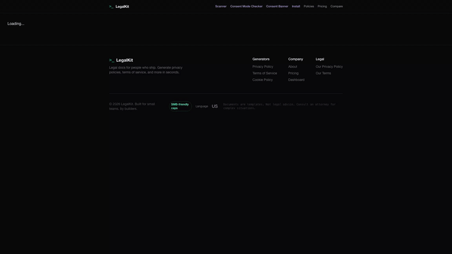
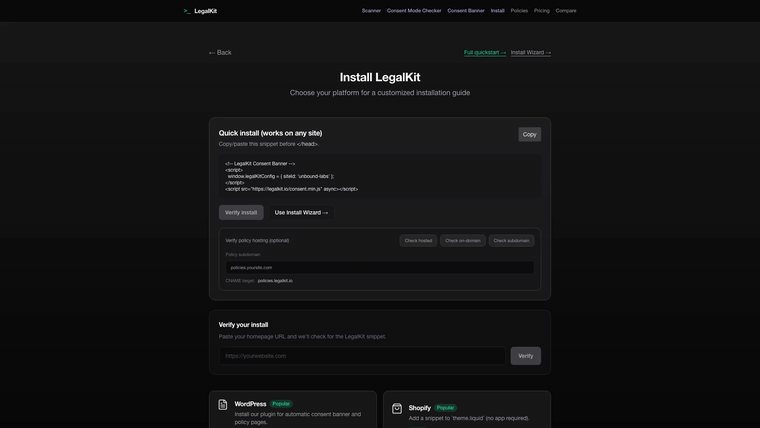
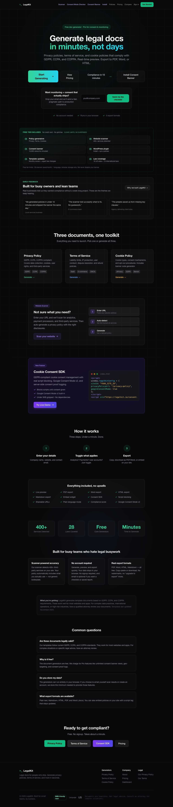
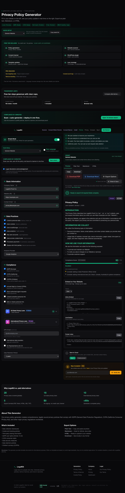

# LegalKit Demos

GitHub renders GIFs inline. Click the GIF to open the full MP4.

## 1) Hero (under 1 min)

What it shows:
- Scan flow on `unbound-labs.com` (URL entry -> scan -> findings)
- One-click fix queued from the scanner report
- Live banner on `unbound-labs.com` plus persistence after reload

## 2) Core Flow Demos

Scanner

Wizard

Consent

Integrate

Live Install

Full Walkthrough

## 3) Product Screenshots

## Archive

Older notes: `demo/more/2026-02-10.md`
