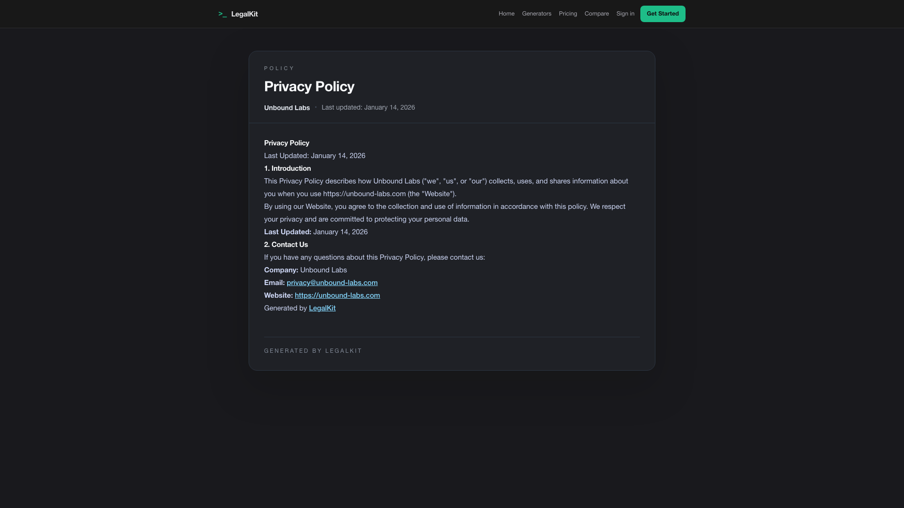
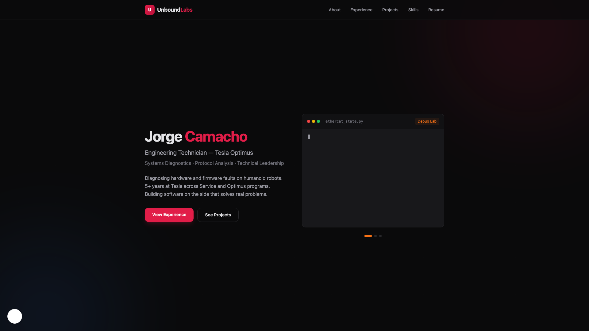

# LegalKit Demo (One Canonical Flow)

This repo has one primary demo. Click the GIF to open the full MP4.

What this single take demonstrates:
- Scan `https://www.unbound-labs.com`
- Review detected compliance issues
- Apply one-click remediation
- Manually enter company/privacy details in the generator
- Generate policy output
- Move through deploy checklist statuses
- Open the hosted privacy policy URL generated for this site
- Validate live consent persistence on reload

Proof frames from that same hero take:

1. Before scan (URL entered)

2. Hosted policy page generated + live

3. Live reload without banner (consent persisted)

Archive: `demo/archive/`
