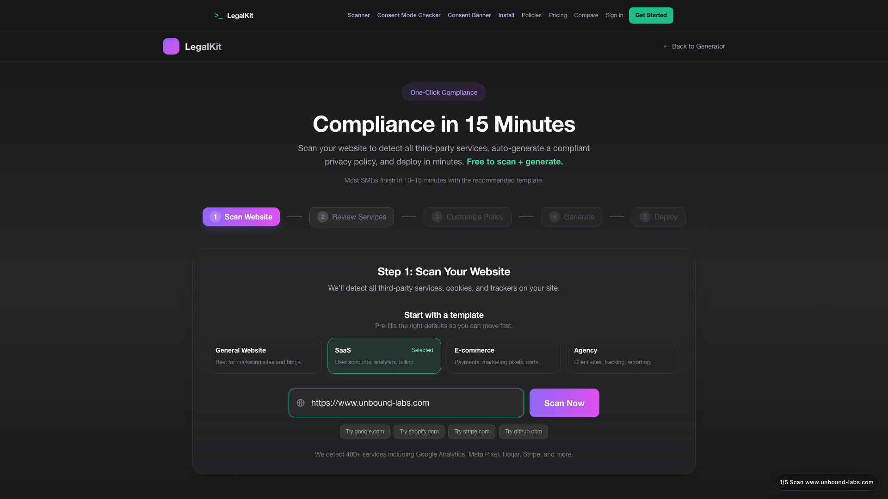
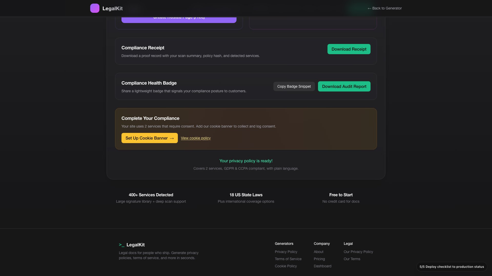
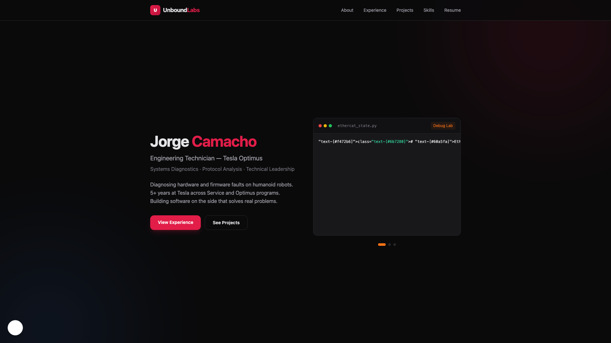

# LegalKit Demos

GitHub renders GIFs inline. Click the GIF to open the full MP4.

## 1) Hero (under 1 min)

What it shows:
- Full LegalKit pipeline on `https://www.unbound-labs.com`
- Scan -> issue review -> one-click remediation -> manual company/privacy inputs -> policy generation -> deploy checklist
- Live domain check confirms consent banner behavior persists after reload

Hero proof frames:

Before scan input

After manual policy details entered

After live reload (consent persisted)

## 2) Core Flow Demos

Scanner

Wizard

Consent

Integrate

Live Install

Full Walkthrough

## 3) Product Screenshots

## Archive

Older notes: `demo/more/2026-02-10.md`
