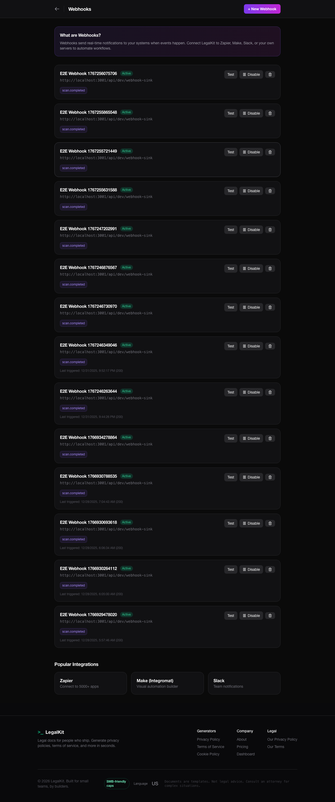

# Demo

## Best Stills
Homepage:

Scanner results:

Consent demo:

Privacy policy preview:

Authenticated UI (optional):

## Short Videos
These are short Playwright recordings (`.webm`).

- Admin settings: [`video_01_admin-LegalKit-Admin-Settings-page-loads-and-shows-header-chromium.webm`](videos/video_01_admin-LegalKit-Admin-Settings-page-loads-and-shows-header-chromium.webm)
- Frontend policy page: [`video_02_frontend-Frontend-Policy-R-20e74-policy-showcase-page-exists-chromium.webm`](videos/video_02_frontend-Frontend-Policy-R-20e74-policy-showcase-page-exists-chromium.webm)
- Gutenberg block: [`video_03_blocks-Gutenberg-Blocks-Policy-block-renders-on-frontend-chromium.webm`](videos/video_03_blocks-Gutenberg-Blocks-Policy-block-renders-on-frontend-chromium.webm)
- Plugin UX (no JS errors): [`video_04_plugin-ux-LegalKit-Plugin--fa1cd-ard-loads-without-JS-errors-chromium.webm`](videos/video_04_plugin-ux-LegalKit-Plugin--fa1cd-ard-loads-without-JS-errors-chromium.webm)
- Setup wizard: [`video_05_admin-LegalKit-Admin-Setup-wizard-page-loads-chromium.webm`](videos/video_05_admin-LegalKit-Admin-Setup-wizard-page-loads-chromium.webm)
- Plugin modal: [`video_06_plugin-ux-LegalKit-Plugin--43723-modal-opens-on-button-click-chromium.webm`](videos/video_06_plugin-ux-LegalKit-Plugin--43723-modal-opens-on-button-click-chromium.webm)
