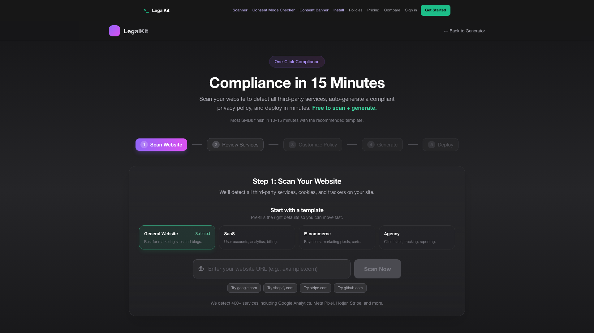
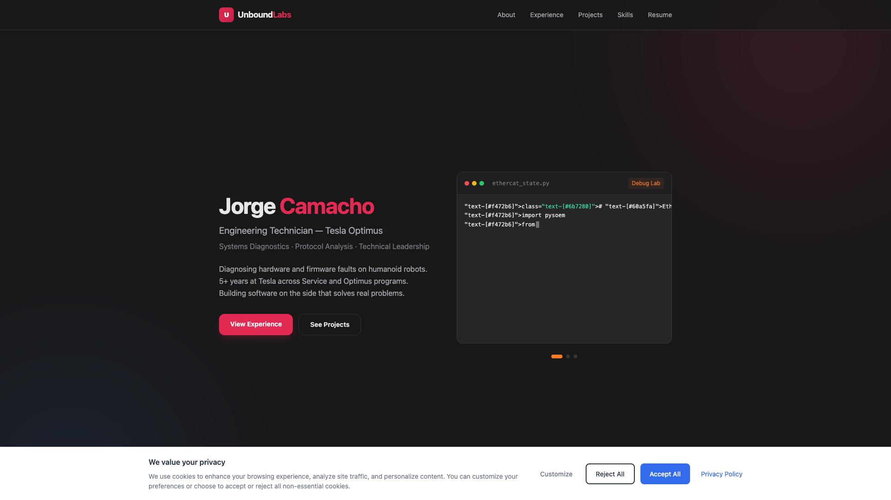
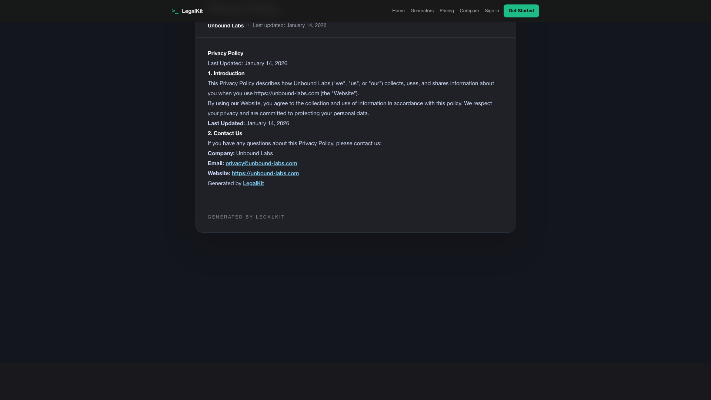
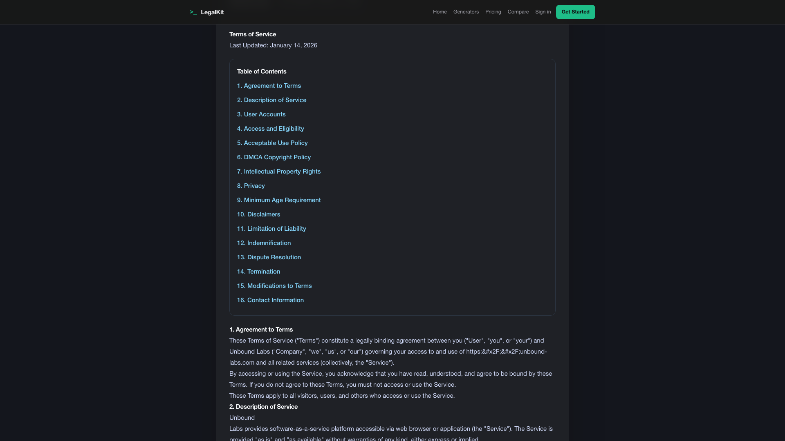
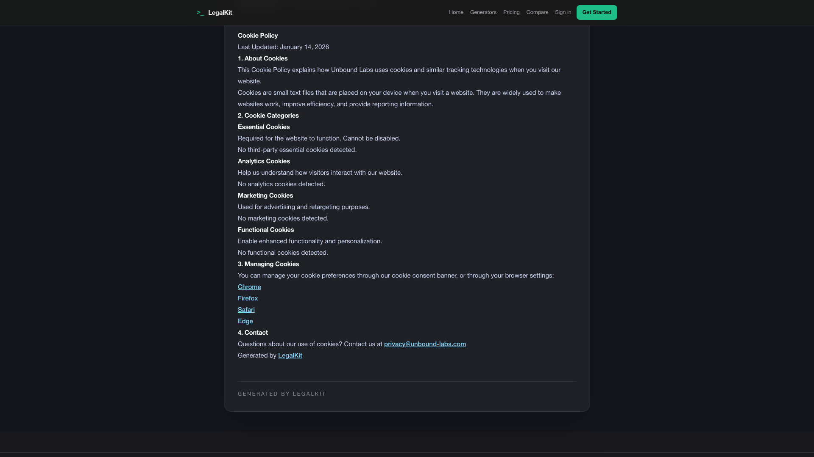

# LegalKit Demo

Full walkthrough of the scan-to-compliance pipeline using `https://www.unbound-labs.com`.
This run includes compliance workflow plus hosted **Privacy**, **Terms**, and **Cookies** policy verification.

[Download MP4](demo.mp4)

## Flow (in order)

1. Scan `www.unbound-labs.com` and detect compliance gaps.
2. Review issues and queue one-click remediation.
3. Generate policy content from scan context.
4. Complete deploy/compliance steps in the wizard.
5. Verify hosted policy routes: Privacy, **Terms**, Cookies.
6. Verify live consent behavior on production.

## Key screenshots

Scan begins with target site input and service detection.

Deploy checklist confirms hosted docs, banner setup, and monitoring.

Live site after deploy with consent controls visible.

Hosted privacy policy generated from scan + form inputs.

Hosted Terms page rendered and verified in the flow.

Hosted cookie policy route live on production.
