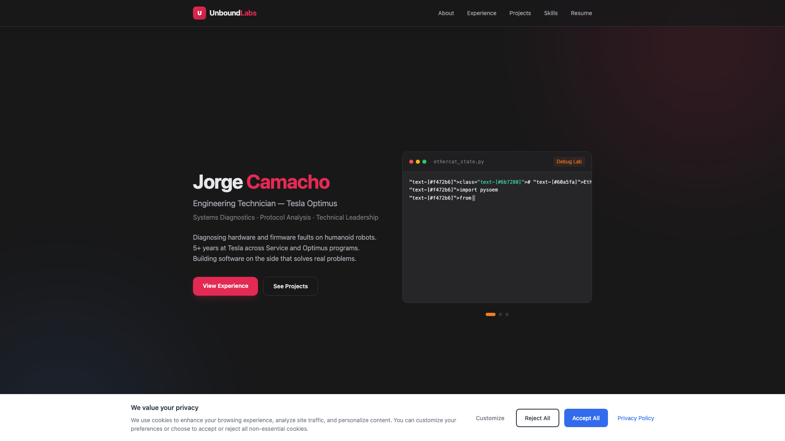
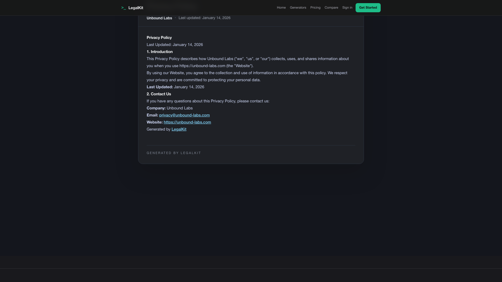
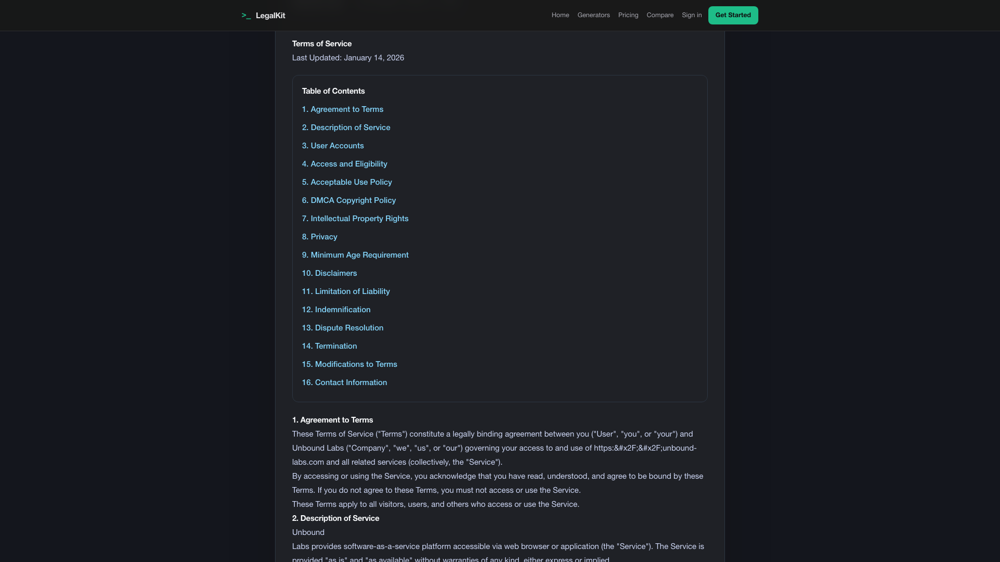
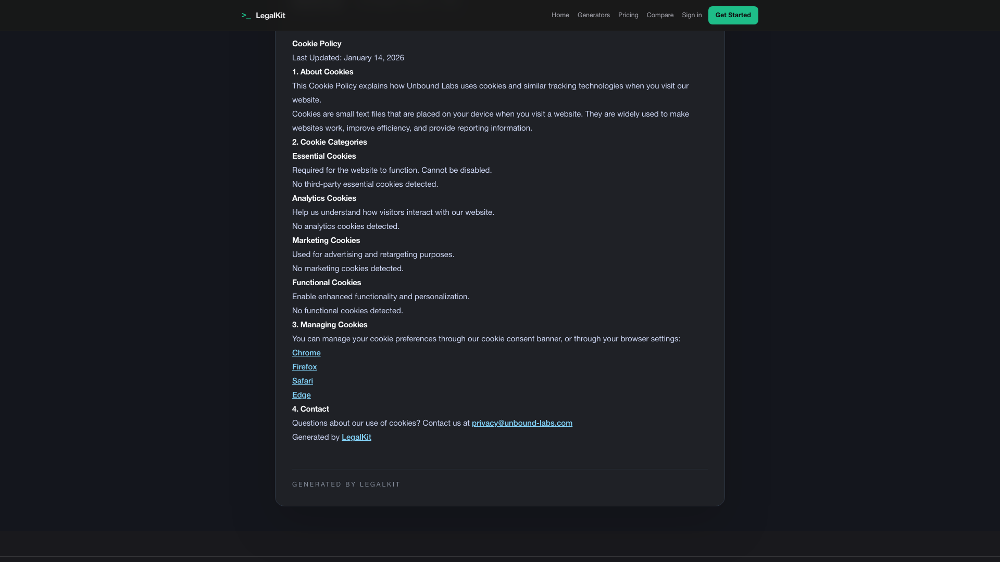

# LegalKit: Scan To Live Compliance

LegalKit gives humans and agents the same end-to-end compliance workflow:
scan a live site, generate hosted **Privacy**, **Terms**, and **Cookies** pages,
then verify consent behavior on production.

| Live input | Hosted output | Verification |
| --- | --- | --- |
| `www.unbound-labs.com` | Privacy, Terms, Cookies | Install checks + live banner |

[Watch the full walkthrough (MP4)](demo.mp4)  
[Download the short hero reel (MP4)](hero.mp4)

## What this proves

1. LegalKit scans a real production site and turns detected services into compliance work.
2. The same run generates hosted `privacy`, `terms`, and `cookies` routes.
3. Verification happens against the live site, not a mock or static example.

## Proof frames

<table>
  <tr>
    <td width="50%" align="center">
      
       
      Consent banner visible on the live production site.
    </td>
    <td width="50%" align="center">
      
       
      Hosted privacy policy generated from scan context.
    </td>
  </tr>
  <tr>
    <td width="50%" align="center">
      
       
      Hosted Terms page rendered and verified in the same flow.
    </td>
    <td width="50%" align="center">
      
       
      Hosted cookie policy published and checked live.
    </td>
  </tr>
</table>

## Full walkthrough

The full proof reel covers this exact sequence:

1. Scan `www.unbound-labs.com` and detect compliance gaps.
2. Review issues and queue one-click remediation.
3. Generate policy content from scan context.
4. Complete deploy and verification steps in the wizard.
5. Open hosted Privacy, Terms, and Cookies pages.
6. Confirm live consent behavior on production.
